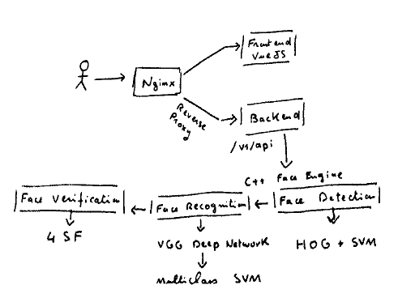

## Selfie Pay

### Biometrics for payment authentication

Selfie payment demo is a demo of the use of facial recognition to verify a user’s identity, simplifying online shopping.
You can try a simple demo of the technolgy here : http://www.selfiekyc.com/

### Steps to access the demo
#### Create a new user
* Acces the web page selfiekyc.com
* If you don't have an account please click on Create Account
* Please fill the required basic infos and click on Continue
* Please authorize your browser to access the Camera and take a Selfie
* If the Selife image is clear please click on Continue otherwise you can take another selfie
* Please click on submit
### Test the authentication mechanism

### How it works

#### Architecture Overview

 
